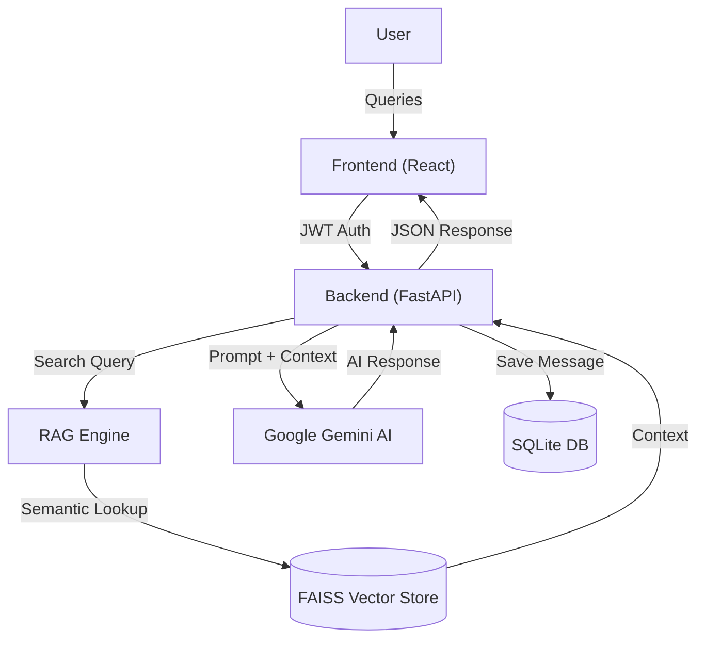

<div align="center">


# JusticeBridge AI

*Empowering Pakistan with Context-Aware Legal Intelligence.*

**An AI-powered legal platform that leverages RAG (Retrieval-Augmented Generation) to provide accurate, citation-backed answers for Pakistan Penal Code, Constitution, and Religious Jurisprudence.**

[](https://fastapi.tiangolo.com/)
[](https://reactjs.org/)
[](https://vitejs.dev/)
[](https://ai.google.dev/)
[](https://sqlite.org/)
[](https://opensource.org/licenses/MIT)

[Live Demo](https://justice-bridge.vercel.app) · [Report Bug](https://github.com/HaseebAhmad24-collab/JusticeBridge/issues) · [Request Feature](https://github.com/HaseebAhmad24-collab/JusticeBridge/issues)

</div>

---

## 🌟 Why This Matters

Access to legal aid is often expensive and slow. **JusticeBridge AI** bridges this gap by:
- **Democratizing Legal Knowledge**: Providing instant access to complex legal documents in simple Roman Urdu or English.
- **Accuracy First**: Unlike generic AI, our RAG system cross-references real legal documents before answering.
- **Empowering Professionals**: Assisting law students and researchers with quick references and case summaries.

---

## 🚀 Key Features

- **🧠 Legal RAG Engine**: Semantic search across Pakistan's major laws (PPC, CrPC, CPC, Constitution).
- **💬 Intelligent Chat**: Persistent, session-based legal consultation with history and message editing.
- **🎙️ Voice-First Interface**: Support for voice commands and high-quality AI voice responses (TTS).
- **📚 Integrated Legal Library**: A digital repository of essential legal documents.
- **🛡️ Secure & Private**: OAuth2 authentication with encrypted session management.

---

## 🏗️ System Architecture



---

## 🛠️ Installation & Setup

### Prerequisites
- Python 3.9+
- Node.js 18+
- Google Gemini API Key

### Getting Started

1. **Clone the repository**:
   ```bash
   git clone https://github.com/HaseebAhmad24-collab/JusticeBridge.git
   cd JusticeBridge
   ```

2. **Configure Backend**:
   - Navigate to `backend/`
   - Create a `.env` file:
     ```env
     GEMINI_API_KEY=your_key_here
     SECRET_KEY=your_random_secret
     ```
   - Install dependencies:
     ```bash
     pip install -r requirements.txt
     ```

3. **Configure Frontend**:
   - Navigate to `frontend/`
   - Install dependencies:
     ```bash
     npm install
     ```

4. **Run Project**:
   Double-click `run_project.bat` or run:
   ```bash
   # Backend
   uvicorn main:app --reload
   
   # Frontend
   npm run dev
   ```

---

## 🗺️ Future Roadmap

- [ ] **Premium Subscriptions**: Integrated payments via Stripe.
- [ ] **Document Analysis**: Uploading case-specific PDFs for AI summarization.
- [ ] **Legal Community**: A platform to connect users with verified lawyers.
- [ ] **Multi-lingual UI**: Native Urdu Nastaliq support.

## 📄 License
Distributed under the MIT License. See `LICENSE` for more information.

---
<div align="center">
Built with ❤️ for a more accessible legal system in Pakistan.
</div>
