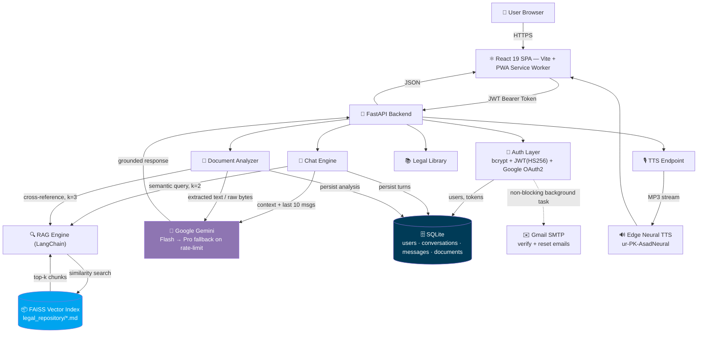
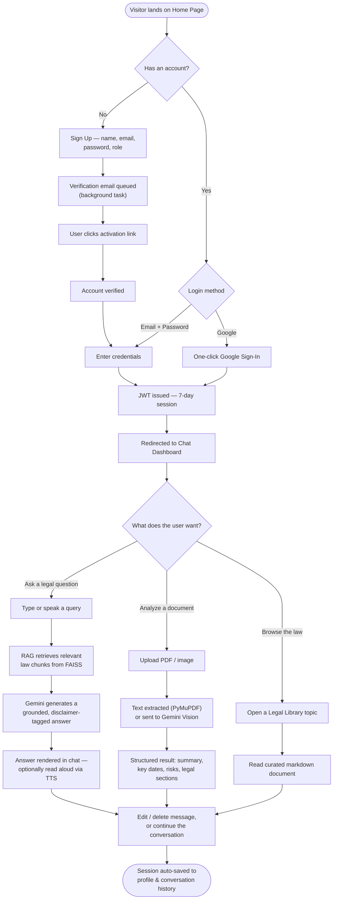

<div align="center">

# ⚖️ JusticeBridge AI

### AI-Powered Legal Intelligence for Pakistan

*A Retrieval-Augmented Generation platform that turns Pakistan's Penal, Civil, Procedural, Tax, Cyber and Religious law into instant, citation-grounded answers — instead of generic, hallucination-prone AI chat.*

<br/>

[](https://reactjs.org/)
[](https://vitejs.dev/)
[](https://fastapi.tiangolo.com/)
[](https://python.org/)
[](https://ai.google.dev/)
[](https://www.langchain.com/)
[](https://faiss.ai/)
[](https://sqlite.org/)
[](https://web.dev/progressive-web-apps/)
[](https://vercel.com/)
[](https://render.com/)
[](LICENSE)
[](https://justice-bridge.vercel.app)

<br/>

[🌐 Live Demo](https://justice-bridge.vercel.app) · [🐛 Report Bug](https://github.com/HaseebAhmad24-collab/JusticeBridge/issues) · [✨ Request Feature](https://github.com/HaseebAhmad24-collab/JusticeBridge/issues)

</div>

---

## 📋 Table of Contents

<table>
<tr>
<td valign="top" width="50%">

**🔎 Understand the Project**
- [Overview](#-overview)
- [Live Demo](#-live-demo)
- [Features](#-features)
- [System Architecture](#-system-architecture)
- [User Flow](#-user-flow)
- [How the RAG Pipeline Works](#-how-the-rag-pipeline-works)
- [Tech Stack](#-tech-stack)

</td>
<td valign="top" width="50%">

**⚙️ Build, Run & Ship It**
- [Project Structure](#-project-structure)
- [Getting Started](#-getting-started)
- [Environment Variables](#-environment-variables)
- [API Reference](#-api-reference)
- [Deployment](#-deployment)
- [Security Highlights](#-security-highlights)
- [Roadmap](#-roadmap)
- [About This Project](#-about-this-project)
- [License](#-license)

</td>
</tr>
</table>

---

## 🌟 Overview

### The Problem
Access to legal clarity in Pakistan is slow and expensive. A citizen with a simple question — *"Can police search my phone at a checkpoint?"*, *"What is my inheritance share as a daughter?"*, *"Is my landlord's eviction notice valid?"* — has no fast, trustworthy, affordable place to ask it. Generic AI chatbots answer confidently but without grounding in actual Pakistani statutes, which makes them unreliable for legal questions.

### The Solution
**JusticeBridge AI** is a full-stack legal-tech platform that pairs **Google Gemini** with a custom **Retrieval-Augmented Generation (RAG)** pipeline built on **FAISS** vector search over a curated repository of real Pakistani legal texts — the Pakistan Penal Code, the Constitution, CrPC, CPC, the Evidence Order, Tax & Cyber Crime laws, and Islamic family/inheritance law. Instead of letting the LLM answer from memory, every query is first matched against indexed legal source text, and that text is injected into the model's context — so answers are traceable back to real law, not invented.

On top of the chat engine, the platform also lets users **upload their own case documents** (PDFs or scanned images) for AI-driven structured analysis, **speak questions aloud** and hear spoken answers, and **browse a built-in legal library** — all wrapped in an installable, mobile-first Progressive Web App.

> Built for law students, legal researchers, litigants, and everyday citizens who need fast, credible legal orientation — not a replacement for a licensed lawyer.

---

## 🖥️ Live Demo

| | |
|---|---|
| **Frontend (Vercel)** | [justice-bridge.vercel.app](https://justice-bridge.vercel.app) |
| **Backend (Render)** | FastAPI REST API, consumed by the frontend above |
| **Repository** | [github.com/HaseebAhmad24-collab/JusticeBridge](https://github.com/HaseebAhmad24-collab/JusticeBridge) |

---

## ✨ Features

### 🔐 Authentication & Security
| Feature | Description |
|---|---|
| **Email / Password Auth** | Signup with bcrypt-hashed + salted passwords |
| **Email Verification** | Tokenized activation link (24h expiry), sent as a non-blocking background task |
| **Google OAuth 2.0** | Server-verified one-click sign-in with Google ID tokens |
| **JWT Sessions** | Stateless 7-day bearer tokens (HS256) |
| **Forgot / Reset Password** | Email-based reset flow with 1-hour token expiry and enumeration-safe responses |
| **Role Selection** | Legal Researcher · Law Student · Litigant · Legal Enthusiast |

### 🧠 Legal AI Chat
| Feature | Description |
|---|---|
| **RAG-Grounded Answers** | Responses backed by FAISS-indexed Pakistani legal source documents |
| **Multi-Law Coverage** | PPC 1860, Constitution 1973, CrPC, CPC, QSO (Evidence), Labor, Tax & Cyber Crime laws |
| **Bilingual** | Replies in English or Roman Urdu, mirroring the user's query language |
| **Persistent History** | Multi-session conversations, fully stored server-side per user |
| **Draft Auto-Save** | Unsent input auto-saved to `localStorage` per chat session |
| **Message Edit / Delete** | Re-submit an edited query or permanently delete any message |
| **Model Fallback** | Auto-retries with backoff on rate limits, then falls back Gemini Flash → Pro |
| **Auto Titles** | Session titles generated from the first query |

### 🎙️ Voice Interface
| Feature | Description |
|---|---|
| **Voice Input** | Speech-to-text via the Web Speech API |
| **AI Voice Output** | Server-rendered speech via Microsoft Edge Neural TTS (`ur-PK-AsadNeural`) |
| **Per-Message Playback** | Independent browser `SpeechSynthesis` toggle to listen to any message |

### 📄 Document Analysis
| Feature | Description |
|---|---|
| **PDF / Image Upload** | `.pdf`, `.jpg`, `.jpeg`, `.png` up to 10 MB |
| **Native PDF Extraction** | PyMuPDF pulls text directly from text-layer PDFs |
| **Scanned Doc / Image Vision** | Falls back to Gemini multimodal vision for scans and images |
| **Structured Output** | Strict-JSON summary, key dates, strong points, risks, and relevant legal sections |
| **RAG Cross-Reference** | Analysis enriched with matched law references from the vector index |
| **In-Chat Integration** | Results render as a rich card directly inside the active chat thread |

### 📚 Legal Library
| Feature | Description |
|---|---|
| **Curated Repository** | 12 hand-written full-text topic documents covering civil, criminal & religious law |
| **Collapsible Navigation** | Grouped into "Laws of Pakistan" and "Religious Law" sidebar sections |
| **Markdown Rendering** | GitHub-flavored markdown with tables, via `react-markdown` + `remark-gfm` |

### 👤 User Profile
| Feature | Description |
|---|---|
| **Dashboard** | Name, email, role, join date, and recent chat activity |
| **Edit Profile** | Update display name and role through an animated modal |

### 📱 Progressive Web App
| Feature | Description |
|---|---|
| **Installable** | Native install prompt on Android/Desktop Chrome via `beforeinstallprompt` |
| **iOS Guide** | Custom step-by-step "Add to Home Screen" modal for Safari (no native prompt on iOS) |
| **Offline-Ready Shell** | Workbox service worker precaches the app shell |

### 🎨 UI / UX
| Feature | Description |
|---|---|
| **Glassmorphism Design** | Dark, frosted-glass card system driven entirely by CSS custom properties |
| **Framer Motion** | Staggered entrances, scroll-triggered reveals, hover/tap micro-interactions |
| **Reduced-Motion Aware** | Respects `prefers-reduced-motion` via `useReducedMotion()` |
| **Fully Responsive** | Fluid layouts, hamburger nav, and device safe-area support (notch/home-indicator) |
| **Toast Feedback** | Real-time success/error toasts on every action |

---

## 🏗️ System Architecture


```mermaid
graph TD
    U["👤 User Browser"] -->|HTTPS| FE["⚛️ React 19 SPA — Vite + PWA Service Worker"]
    FE -->|JWT Bearer Token| BE["🚀 FastAPI Backend"]

    BE --> AUTH["🔐 Auth Layer<br/>bcrypt + JWT(HS256) + Google OAuth2"]
    BE --> CHAT["💬 Chat Engine"]
    BE --> DOC["📄 Document Analyzer"]
    BE --> LIB["📚 Legal Library"]
    BE --> TTS["🎙️ TTS Endpoint"]

    CHAT -->|semantic query, k=2| RAG["🔍 RAG Engine (LangChain)"]
    DOC -->|cross-reference, k=3| RAG
    RAG -->|similarity search| FAISS[("📦 FAISS Vector Index<br/>legal_repository/*.md")]
    FAISS -->|top-k chunks| RAG

    CHAT -->|context + last 10 msgs| GEMINI["🤖 Google Gemini<br/>Flash → Pro fallback on rate-limit"]
    DOC -->|extracted text / raw bytes| GEMINI
    GEMINI -->|grounded response| BE

    AUTH -->|users, tokens| DB[("🗄️ SQLite<br/>users · conversations · messages · documents")]
    CHAT -->|persist turns| DB
    DOC -->|persist analysis| DB

    AUTH -.->|non-blocking background task| SMTP["✉️ Gmail SMTP<br/>verify + reset emails"]
    TTS -->|MP3 stream| EDGE["🔊 Edge Neural TTS<br/>ur-PK-AsadNeural"]
    EDGE --> FE

    BE -->|JSON| FE

    style GEMINI fill:#8E75B2,color:#fff
    style FAISS fill:#00A4EF,color:#fff
    style DB fill:#003B57,color:#fff
```

**Deployment split:** the React SPA is statically hosted on **Vercel**; the FastAPI service runs on **Render** as a single web dyno (`uvicorn main:app`), with CORS locked to the deployed frontend origin only.

---

## 🔄 User Flow


```mermaid
flowchart TD
    A(["Visitor lands on Home Page"]) --> B{"Has an account?"}

    B -->|No| C["Sign Up — name, email,<br/>password, role"]
    C --> D["Verification email queued<br/>(background task)"]
    D --> E["User clicks activation link"]
    E --> F["Account verified"]

    B -->|Yes| G{"Login method"}
    G -->|Email + Password| H["Enter credentials"]
    G -->|Google| I["One-click Google Sign-In"]
    F --> H

    H --> J["JWT issued — 7-day session"]
    I --> J
    J --> K["Redirected to Chat Dashboard"]

    K --> L{"What does the user want?"}

    L -->|Ask a legal question| M["Type or speak a query"]
    M --> N["RAG retrieves relevant<br/>law chunks from FAISS"]
    N --> O["Gemini generates a<br/>grounded, disclaimer-tagged answer"]
    O --> P["Answer rendered in chat —<br/>optionally read aloud via TTS"]

    L -->|Analyze a document| Q["Upload PDF / image"]
    Q --> R["Text extracted (PyMuPDF)<br/>or sent to Gemini Vision"]
    R --> S["Structured result: summary,<br/>key dates, risks, legal sections"]

    L -->|Browse the law| T["Open a Legal Library topic"]
    T --> U["Read curated markdown document"]

    P --> V["Edit / delete message,<br/>or continue the conversation"]
    S --> V
    U --> V

    V --> W(["Session auto-saved to<br/>profile & conversation history"])
```

---

## 🧬 How the RAG Pipeline Works

Instead of trusting the LLM's memory of the law, every chat query and document analysis is **grounded** in real source text before Gemini ever sees it:

1. **Ingestion** — `.md` (and `.pdf`) files under `backend/legal_repository/` are chunked with a `RecursiveCharacterTextSplitter` that deliberately splits on `\nSection`, `\nArticle`, `\nChapter` boundaries first, so legal clauses stay intact.
2. **Embedding** — each chunk is embedded via Google's `gemini-embedding-001` model and stored in a **FAISS** vector index, persisted to disk (`faiss_index/`) so it only needs to be rebuilt when the source repository changes.
3. **Retrieval** — on every `/chat` request, the user's query is embedded and matched against the index (`k=2`); on document analysis, the extracted text is matched (`k=3`).
4. **Grounded generation** — the retrieved chunks are injected into Gemini's `system_instruction` as a *"ground truth reference context"* block, with an explicit instruction to prioritize it for factual accuracy.
5. **Resilience** — if Gemini Flash hits a rate limit, the backend retries with exponential backoff, then transparently falls back to Gemini Pro so the user still gets an answer.

---

## 🛠️ Tech Stack

| Layer | Technology | Purpose |
|---|---|---|
| **Frontend** | React 19 + Vite 7 | SPA with fast HMR dev server |
| **Styling** | Vanilla CSS + Custom Properties | Hand-built glassmorphism design system |
| **Animation** | Framer Motion | Page transitions & micro-interactions |
| **Icons** | Lucide React | Consistent icon set |
| **PWA** | vite-plugin-pwa (Workbox) | Installable app shell + service worker |
| **Backend** | FastAPI + Uvicorn | Async REST API server |
| **AI** | Google Gemini (Flash / Pro) | Legal Q&A generation + multimodal document vision |
| **RAG Orchestration** | LangChain | Document loading, chunking, embeddings glue |
| **Vector Search** | FAISS | Semantic similarity search over legal text |
| **Auth** | OAuth2 + JWT (`python-jose`) + bcrypt | Stateless, hashed, verifiable sessions |
| **Database** | SQLite + SQLAlchemy ORM | Users, conversations, messages, documents |
| **PDF Parsing** | PyMuPDF | Text extraction from native PDFs |
| **TTS** | Microsoft Edge TTS | Urdu-accented neural voice synthesis |
| **Email** | Gmail SMTP (SSL) via `BackgroundTasks` | Non-blocking verification & reset emails |
| **Frontend Hosting** | Vercel | Static SPA deployment |
| **Backend Hosting** | Render | FastAPI web service (`Procfile`) |

---

## 📁 Project Structure

```
JusticeBridge/
├── backend/
│   ├── main.py               # FastAPI app — models, routes, auth, chat, docs, TTS
│   ├── rag_system.py         # LegalRAG — FAISS index build/load/search
│   ├── knowledge_base.py     # Legal Library content store + RAG glue
│   ├── data_pipeline.py      # Manual web-scraping ingestion script
│   ├── legal_repository/     # Source legal documents (laws/ + religious/)
│   ├── faiss_index/          # Persisted FAISS vector embeddings
│   ├── requirements.txt      # Python dependencies
│   ├── Procfile               # Render web process definition
│   └── .env.example           # Backend environment variable template
│
├── frontend/
│   ├── src/
│   │   ├── App.jsx            # App shell — chat UI, sidebar, view routing, state
│   │   ├── Auth.jsx           # Login / Register / Google OAuth / password reset
│   │   ├── Home.jsx           # Landing page
│   │   ├── Profile.jsx        # Profile dashboard & edit modal
│   │   ├── main.jsx           # Entry point, service worker registration
│   │   └── *.css              # Design system & per-view styles
│   ├── public/                 # PWA icons, manifest, logo
│   ├── vite.config.js
│   └── .env.example            # Frontend environment variable template
│
├── run_project.bat            # One-click local dev launcher (Windows)
└── README.md
```

---

## 🚀 Getting Started

### Prerequisites
- **Python** 3.9+
- **Node.js** 18+
- A [Google Gemini API Key](https://aistudio.google.com/app/apikey)
- *(Optional)* A [Google OAuth Client ID](https://console.cloud.google.com/) for Google Sign-In
- *(Optional)* A Gmail App Password for verification/reset emails

### 1. Clone the Repository
```bash
git clone https://github.com/HaseebAhmad24-collab/JusticeBridge.git
cd JusticeBridge
```

### 2. Set Up the Backend
```bash
cd backend
python -m venv venv
venv\Scripts\activate         # Windows
# source venv/bin/activate    # macOS / Linux

pip install -r requirements.txt
cp .env.example .env          # then fill in your keys
```

### 3. Set Up the Frontend
```bash
cd ../frontend
npm install
cp .env.example .env          # then fill in your keys
```

### 4. Run the Project

**Option A — One-click (Windows):**
```bash
./run_project.bat
```

**Option B — Manual (two terminals):**
```bash
# Terminal 1 — Backend
cd backend && uvicorn main:app --reload --port 8000

# Terminal 2 — Frontend
cd frontend && npm run dev
```

Open **http://localhost:5173** in your browser.

---

## 🔑 Environment Variables

**`backend/.env`** *(see [`backend/.env.example`](backend/.env.example))*
```env
GEMINI_API_KEY=your_gemini_api_key_here
SECRET_KEY=generate_a_strong_random_32char_key_here
GOOGLE_CLIENT_ID=your_google_client_id_here

SMTP_USER=your_email@gmail.com
SMTP_PASSWORD=your_gmail_app_password
SMTP_SERVER=smtp.gmail.com
SMTP_PORT=465

FRONTEND_URL=https://your-frontend.vercel.app   # also used to lock down CORS
```

**`frontend/.env`** *(see [`frontend/.env.example`](frontend/.env.example))*
```env
VITE_API_URL=https://your-backend.onrender.com
VITE_GOOGLE_CLIENT_ID=your_google_client_id_here
```

> ⚠️ `SECRET_KEY` must be set explicitly in production — without it, JWT signing falls back to an insecure default baked into source.

---

## 📡 API Reference

<details>
<summary><strong>Click to expand full endpoint list</strong></summary>

| Method | Endpoint | Auth | Description |
|---|---|---|---|
| `POST` | `/register` | ❌ | Register user, queue verification email as a background task |
| `POST` | `/login` | ❌ | Email/password login, returns JWT |
| `POST` | `/auth/google` | ❌ | Google OAuth login / auto-register |
| `POST` | `/auth/verify-email` | ❌ | Activate account via email token |
| `POST` | `/auth/resend-verification` | ❌ | Resend activation email |
| `POST` | `/auth/forgot-password` | ❌ | Send password reset email (enumeration-safe) |
| `POST` | `/auth/reset-password` | ❌ | Set new password with reset token |
| `GET` | `/users/me` | ✅ | Get current user profile |
| `PATCH` | `/users/me` | ✅ | Update display name or role |
| `POST` | `/chat` | ✅ | Send message, receive RAG-grounded AI response |
| `GET` | `/conversations` | ✅ | Fetch all sessions with messages |
| `DELETE` | `/conversations/{id}` | ✅ | Delete a chat session |
| `DELETE` | `/messages/{id}` | ✅ | Delete a single message |
| `POST` | `/documents/analyze` | ✅ | Upload & analyze a PDF or image |
| `GET` | `/documents/history` | ✅ | Fetch all analyzed document records |
| `GET` | `/legal-library/{topic}` | ❌ | Retrieve a built-in legal document |
| `POST` | `/tts` | ❌ | Convert text to speech (returns MP3) |

</details>

---

## ☁️ Deployment

| | |
|---|---|
| **Frontend** | Vercel — static build of the Vite/React SPA, env vars configured in the Vercel dashboard |
| **Backend** | Render — Python web service running `uvicorn main:app --host 0.0.0.0 --port $PORT` via [`Procfile`](backend/Procfile) |
| **CORS** | Locked to `FRONTEND_URL` only (not wildcarded) so the deployed API only accepts requests from the deployed frontend |
| **Vector Index** | `faiss_index/` is built once at backend startup and persisted, avoiding re-embedding on every deploy restart |
| **Secrets** | Managed entirely via platform environment variables — never committed (`.env` is git-ignored; `.env.example` documents the required keys) |

---

## 🔐 Security Highlights

- **Password hashing** — bcrypt with per-password salt, never stored or logged in plaintext.
- **Stateless JWT auth** — HS256-signed 7-day bearer tokens; every protected route validates the token and re-resolves the user from the database.
- **Mandatory email verification** — unverified accounts are blocked from logging in.
- **Enumeration-safe password reset** — `/auth/forgot-password` always returns the same generic message, whether or not the email exists.
- **Non-blocking email delivery** — verification/reset emails run via FastAPI `BackgroundTasks` so SMTP latency never stalls the HTTP response.
- **Scoped CORS** — restricted to the configured frontend origin in production rather than `*`.
- **Server-verified OAuth** — Google ID tokens are cryptographically verified server-side (issuer + audience checked) before trusting any claim.

---

## 🗺️ Roadmap

- [ ] **Premium Subscriptions** — Stripe payment integration
- [ ] **Native Urdu UI** — Nastaliq script support
- [ ] **Lawyer Connect** — Verified lawyer marketplace
- [ ] **Case Tracker** — Manage and follow active legal cases
- [ ] **Multi-language TTS** — English voice in addition to Urdu
- [ ] **Mobile App** — React Native wrapper for iOS & Android

---

## 🎓 About This Project

JusticeBridge AI is a **Final Year Project** built end-to-end — frontend, backend, auth, database design, and a custom RAG pipeline — to demonstrate practical, production-shaped full-stack and applied-AI engineering: real authentication flows, a persisted vector search system, multimodal document understanding, and a deployed, installable PWA, rather than a toy demo.

**Author:** [Haseeb Ahmad](https://github.com/HaseebAhmad24-collab)

---

## 📄 License

Distributed under the **MIT License**. See [`LICENSE`](LICENSE) for details.

---

<div align="center">

Built with ❤️ to make legal knowledge accessible to every Pakistani.

**[⬆ Back to Top](#-justicebridge-ai)**

</div>
