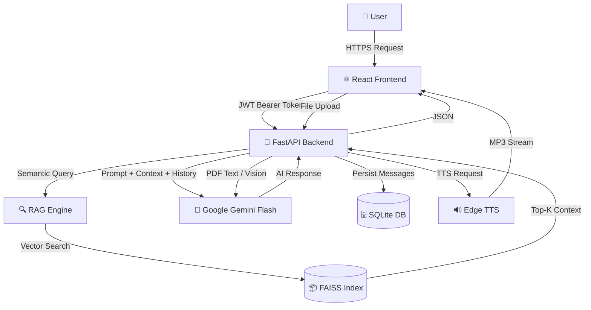

<div align="center">


# ⚖️ JusticeBridge AI

**AI-Powered Legal Intelligence for Pakistan**

*Democratizing access to Pakistan's legal system through context-aware, citation-backed AI.*

<br/>

[](https://fastapi.tiangolo.com/)
[](https://reactjs.org/)
[](https://vitejs.dev/)
[](https://ai.google.dev/)
[](https://sqlite.org/)
[](https://python.org/)
[](LICENSE)
[](https://justice-bridge.vercel.app)

<br/>

[🌐 Live Demo](https://justice-bridge.vercel.app) · [🐛 Report Bug](https://github.com/HaseebAhmad24-collab/JusticeBridge/issues) · [✨ Request Feature](https://github.com/HaseebAhmad24-collab/JusticeBridge/issues)

</div>

---

## 📋 Table of Contents

- [Overview](#-overview)
- [Features](#-features)
- [System Architecture](#-system-architecture)
- [Tech Stack](#-tech-stack)
- [Getting Started](#-getting-started)
- [Environment Variables](#-environment-variables)
- [API Reference](#-api-reference)
- [Project Structure](#-project-structure)
- [Roadmap](#-roadmap)
- [License](#-license)

---

## 🌟 Overview

**JusticeBridge AI** bridges the gap between citizens and Pakistan's complex legal system. Instead of relying on expensive lawyers for basic legal queries, users get instant, accurate answers grounded in real legal documents — powered by **Retrieval-Augmented Generation (RAG)** and **Google Gemini AI**.

> Built for law students, researchers, litigants, and everyday citizens who need affordable legal clarity.

---

## ✨ Features

### 🔐 Authentication & Security

| Feature | Description |
|---|---|
| **Email / Password Auth** | Secure signup with bcrypt-hashed passwords |
| **Email Verification** | Account activation via tokenized email link (24 hr expiry) |
| **Google OAuth 2.0** | One-click sign-in with verified Google accounts |
| **JWT Sessions** | Stateless 7-day bearer tokens (HS256 algorithm) |
| **Forgot / Reset Password** | Secure email-based password reset with 1-hour token expiry |
| **Role Selection** | Legal Researcher · Law Student · Litigant · Legal Enthusiast |

### 🧠 Legal AI Chat

| Feature | Description |
|---|---|
| **RAG-Powered Answers** | Responses grounded in FAISS-indexed Pakistan legal documents |
| **Multi-Law Coverage** | PPC 1860, Constitution, CrPC, CPC, QSO, Tax & Cyber Laws |
| **Bilingual Support** | Responds in English or Roman Urdu matching the user's query |
| **Conversation History** | Persistent multi-session chat with full server-side storage |
| **Draft Auto-Save** | Unsent messages auto-saved to localStorage per session |
| **Message Editing** | Re-submit any previously sent user message with edits |
| **Message Deletion** | Delete individual messages from a conversation |
| **Conversation Delete** | Remove entire chat sessions |
| **AI Retry + Fallback** | Auto-retries on rate limits; falls back Gemini Flash → Pro |
| **Auto Title Generation** | Session titles derived from the first query |

### 🎙️ Voice Interface

| Feature | Description |
|---|---|
| **Voice Input (STT)** | Speak queries via Web Speech API in English or Roman Urdu |
| **AI Voice Responses (TTS)** | Listen to answers with Microsoft Edge TTS (`ur-PK-AsadNeural`) |
| **Toggle Playback** | Play / stop TTS audio on any AI message |

### 📄 Document Analysis

| Feature | Description |
|---|---|
| **PDF & Image Upload** | Accepts `.pdf`, `.jpg`, `.jpeg`, `.png` (max 10 MB) |
| **Text PDF Extraction** | PyMuPDF extracts text from native PDFs for deep analysis |
| **Scanned Doc / Image AI** | Gemini multimodal vision for scanned documents and images |
| **Structured Analysis** | Returns summary, key dates, strengths, weaknesses & legal sections |
| **RAG Cross-Reference** | Analysis enriched with matched Pakistan law references |
| **Analysis History** | All analyzed documents saved and viewable from the profile |
| **In-Chat Integration** | Results flow directly into the active chat session |

### 📚 Legal Library

| Feature | Description |
|---|---|
| **Built-in Repository** | Curated full-text documents for Pakistan's major laws |
| **Collapsible Categories** | Organized into Civil Laws, Criminal Laws, and Religious Jurisprudence |
| **Markdown Rendering** | Professional formatting with `react-markdown` + GFM tables |

### 👤 User Profile

| Feature | Description |
|---|---|
| **Profile Dashboard** | Displays name, email, role, join date, and conversation stats |
| **Edit Name & Role** | Update display name and legal role via animated modal |
| **Document History** | View all past document analysis results inline |

### 📱 Progressive Web App (PWA)

| Feature | Description |
|---|---|
| **Install Prompt** | Native browser install prompt on Android / Desktop Chrome |
| **iOS Install Guide** | Custom "Add to Home Screen" tip for iOS Safari users |
| **Standalone Detection** | Hides install prompt when already running as installed PWA |

### 🎨 UI / UX

| Feature | Description |
|---|---|
| **Glassmorphism Design** | Dark-mode frosted-glass cards with CSS backdrop filters |
| **Framer Motion** | Smooth page transitions and micro-interactions throughout |
| **Toast Notifications** | Real-time feedback for all actions via `react-hot-toast` |
| **Responsive Layout** | Collapsible sidebar + chat layout for desktop and mobile |
| **Animated Landing Page** | Dedicated Home page with hero section and feature highlights |
| **Accessibility** | Respects `prefers-reduced-motion` for reduced-animation users |
| **File Upload Preview** | Inline image or PDF icon preview before submission |

---

## 🏗️ System Architecture


```mermaid
graph TD
    A["👤 User"] -->|HTTPS Request| B["⚛️ React Frontend"]
    B -->|JWT Bearer Token| C["🚀 FastAPI Backend"]
    C -->|Semantic Query| D["🔍 RAG Engine"]
    D -->|Vector Search| E[("📦 FAISS Index")]
    E -->|Top-K Context| C
    C -->|Prompt + Context + History| F["🤖 Google Gemini Flash"]
    F -->|AI Response| C
    C -->|JSON| B
    C -->|Persist Messages| G[("🗄️ SQLite DB")]
    C -->|TTS Request| H["🔊 Edge TTS"]
    H -->|MP3 Stream| B
    B -->|File Upload| C
    C -->|PDF Text / Vision| F
```

---

## 🛠️ Tech Stack

| Layer | Technology | Purpose |
|---|---|---|
| **Frontend** | React 18 + Vite 5 | SPA with fast HMR dev server |
| **Styling** | Vanilla CSS + CSS Variables | Glassmorphism design system |
| **Animations** | Framer Motion | Transitions & micro-interactions |
| **Icons** | Lucide React | Consistent icon set |
| **Backend** | FastAPI + Uvicorn | Async REST API server |
| **AI** | Google Gemini Flash / Pro | Legal Q&A + Document Vision |
| **RAG** | FAISS + Sentence Transformers | Semantic legal document retrieval |
| **Auth** | OAuth2 + JWT (`python-jose`) | Secure stateless sessions |
| **Database** | SQLite + SQLAlchemy ORM | Users, chats, and documents |
| **TTS** | Microsoft Edge TTS | Urdu / English voice synthesis |
| **Email** | SMTP (Gmail SSL/TLS) | Verification & password reset |
| **Deployment** | Vercel + Render | Frontend + Backend cloud hosting |

---

## 🚀 Getting Started

### Prerequisites

- **Python** 3.9+
- **Node.js** 18+
- A [Google Gemini API Key](https://aistudio.google.com/app/apikey)
- *(Optional)* A [Google OAuth Client ID](https://console.cloud.google.com/) for Google Sign-In
- *(Optional)* A Gmail App Password for email verification/reset

### 1. Clone the Repository

```bash
git clone https://github.com/HaseebAhmad24-collab/JusticeBridge.git
cd JusticeBridge
```

### 2. Set Up the Backend

```bash
cd backend

# Create and activate virtual environment
python -m venv venv
venv\Scripts\activate         # Windows
# source venv/bin/activate    # macOS / Linux

# Install Python dependencies
pip install -r requirements.txt

# Create environment file
# (see Environment Variables section below)
```

### 3. Set Up the Frontend

```bash
cd ../frontend
npm install
```

### 4. Run the Project

**Option A — One-click (Windows):**

```bash
# From project root
./run_project.bat
```

**Option B — Manual (two terminals):**

```bash
# Terminal 1 — Backend
cd backend && uvicorn main:app --reload --port 8000

# Terminal 2 — Frontend
cd frontend && npm run dev
```

Open **http://localhost:5173** in your browser.

---

## 🔑 Environment Variables

**`backend/.env`**

```env
# Required
GEMINI_API_KEY=your_google_gemini_api_key
SECRET_KEY=your_random_secret_key_min_32_chars

# Google Sign-In (optional)
GOOGLE_CLIENT_ID=your_google_oauth_client_id

# Email — Gmail App Password (optional)
SMTP_USER=your_gmail_address@gmail.com
SMTP_PASSWORD=your_gmail_app_password
SMTP_SERVER=smtp.gmail.com
SMTP_PORT=465

# Deployment
FRONTEND_URL=http://localhost:5173
```

**`frontend/.env`**

```env
VITE_API_URL=http://localhost:8000
VITE_GOOGLE_CLIENT_ID=your_google_oauth_client_id
```

---

## 📡 API Reference

| Method | Endpoint | Auth | Description |
|---|---|---|---|
| `POST` | `/register` | ❌ | Register user, send verification email |
| `POST` | `/login` | ❌ | Email/password login, returns JWT |
| `POST` | `/auth/google` | ❌ | Google OAuth login / register |
| `POST` | `/auth/verify-email` | ❌ | Activate account via email token |
| `POST` | `/auth/resend-verification` | ❌ | Resend activation email |
| `POST` | `/auth/forgot-password` | ❌ | Send password reset email |
| `POST` | `/auth/reset-password` | ❌ | Set new password with reset token |
| `GET` | `/users/me` | ✅ | Get current user profile |
| `PATCH` | `/users/me` | ✅ | Update display name or role |
| `POST` | `/chat` | ✅ | Send message, receive RAG-enhanced AI response |
| `GET` | `/conversations` | ✅ | Fetch all sessions with messages |
| `DELETE` | `/conversations/{id}` | ✅ | Delete a chat session |
| `DELETE` | `/messages/{id}` | ✅ | Delete a single message |
| `POST` | `/documents/analyze` | ✅ | Upload & analyze PDF or image |
| `GET` | `/documents/history` | ✅ | Fetch all analyzed document records |
| `GET` | `/legal-library/{topic}` | ❌ | Retrieve a built-in legal document |
| `POST` | `/tts` | ❌ | Convert text to speech (returns MP3) |

---

## 📁 Project Structure

```
JusticeBridge/
├── backend/
│   ├── main.py               # FastAPI app — all routes & business logic
│   ├── knowledge_base.py     # Legal library document store
│   ├── rag_system.py         # FAISS semantic search engine
│   ├── data_pipeline.py      # Legal document ingestion pipeline
│   ├── legal_repository/     # Raw Pakistan legal source documents
│   ├── faiss_index/          # Persisted FAISS vector embeddings
│   ├── justicebridge.db      # SQLite database
│   ├── requirements.txt      # Python dependencies
│   └── .env                  # Backend secrets (not committed)
│
├── frontend/
│   ├── src/
│   │   ├── App.jsx           # Main app — chat, routing, state
│   │   ├── Home.jsx          # Landing page
│   │   ├── Auth.jsx          # Login, Register, OAuth flows
│   │   ├── Profile.jsx       # User profile & edit modal
│   │   ├── App.css           # Design system & glassmorphism styles
│   │   └── index.css         # Global CSS variables & resets
│   ├── index.html
│   └── vite.config.js
│
├── run_project.bat           # One-click dev launcher (Windows)
└── README.md
```

---

## 🗺️ Roadmap

- [ ] **Premium Subscriptions** — Stripe payment integration
- [ ] **Native Urdu UI** — Nastaliq script support
- [ ] **Lawyer Connect** — Verified lawyer marketplace
- [ ] **Case Tracker** — Manage and follow active legal cases
- [ ] **Multi-language TTS** — English voice in addition to Urdu
- [ ] **Mobile App** — React Native wrapper for iOS & Android

---

## 📄 License

Distributed under the **MIT License**. See [`LICENSE`](LICENSE) for details.

---

<div align="center">

Built with ❤️ to make legal knowledge accessible to every Pakistani.

**[⬆ Back to Top](#️-justicebridge-ai)**

</div>
